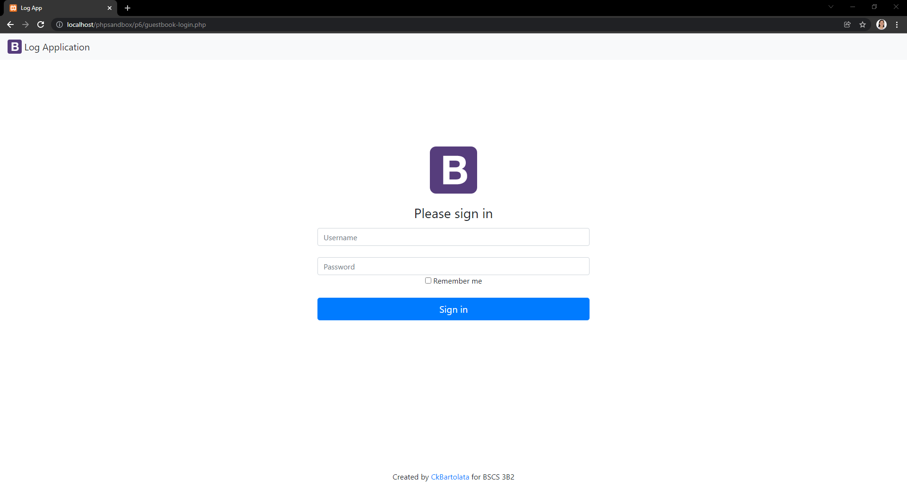
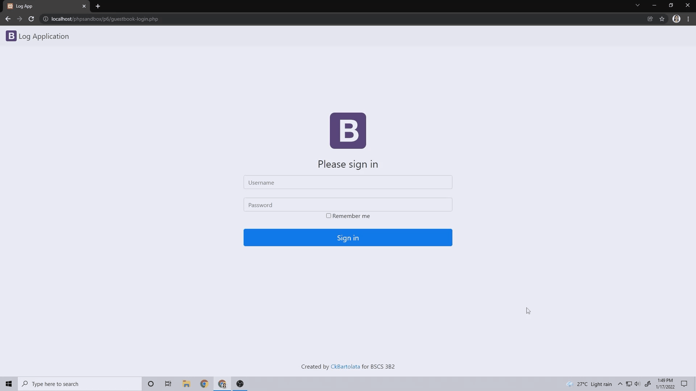
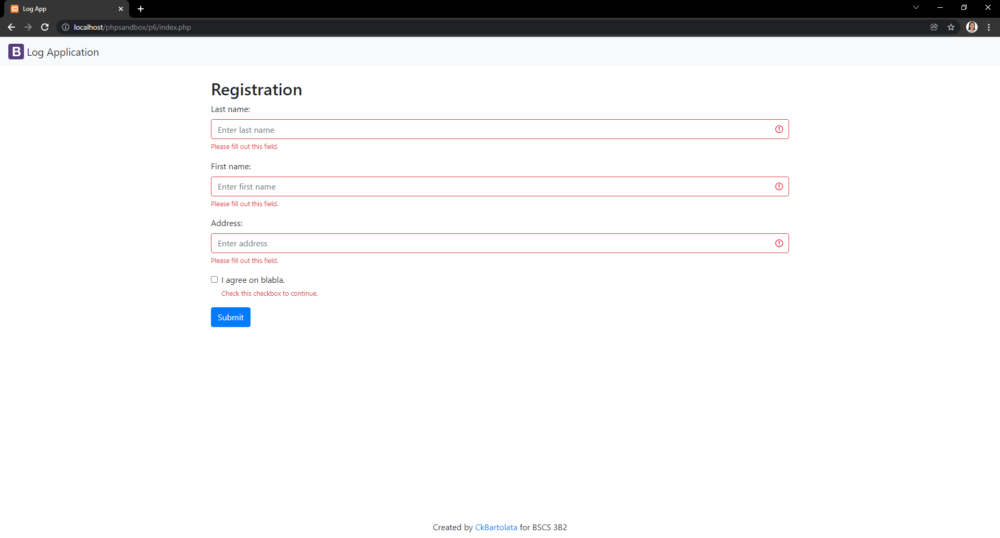
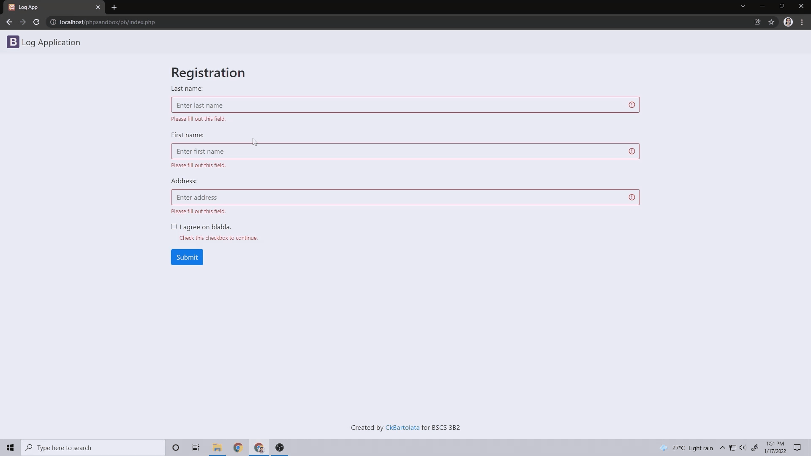
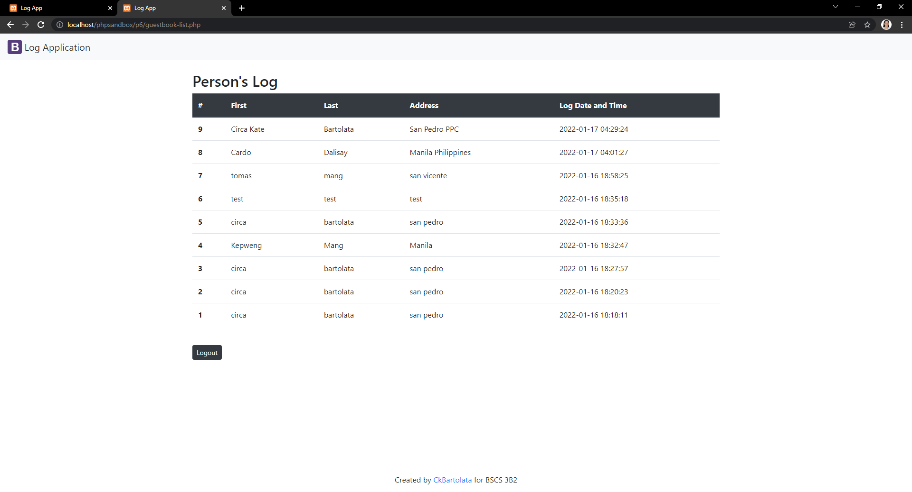

# logApp-Bartolata

**CC 6/L** *06 Practice Sets*

### During this pandemic, we usually encounter logbooks in malls, stores, schools, almost every where. Under Republic Act 11469, Bayanihan to Heal as One Act requires us to provide truthful information. The **logApp** is a sample application that logs the individual's personal information and the date and time he/she visits the place. To protect an individual's personal information (RA 10173, Data Privacy Act of 2012), only users with an admin account can view the list of individuals who visited the premises. 

Completed task are the following:

* prepare database for logApp
  * provide database name
  * create tables: person, account
  * identify fields for two tables
* write a PHP code for the following requirements:
  * login
    * If user credentials does not exist in user account prompt appropriate message
  * display the list of logs
  * register or log the individual's personal information
* HTML
  * footer.php - replace the link, direct it to my github account
  ###

---
$~$

## Log in Page 

## Log in Demonstration 

---
$~$

## Registration Page

## Registration Demo

---
$~$

## Guestbook List

